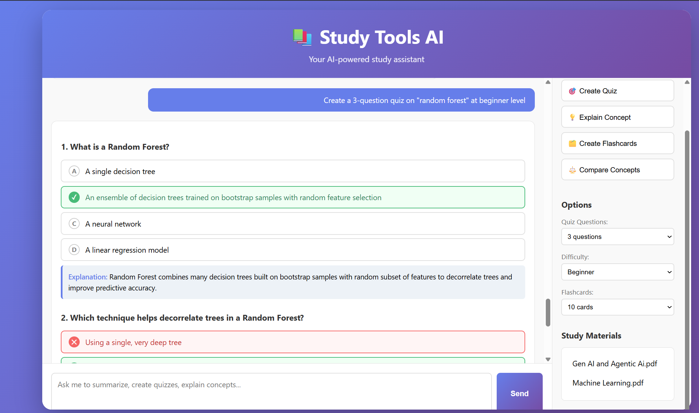
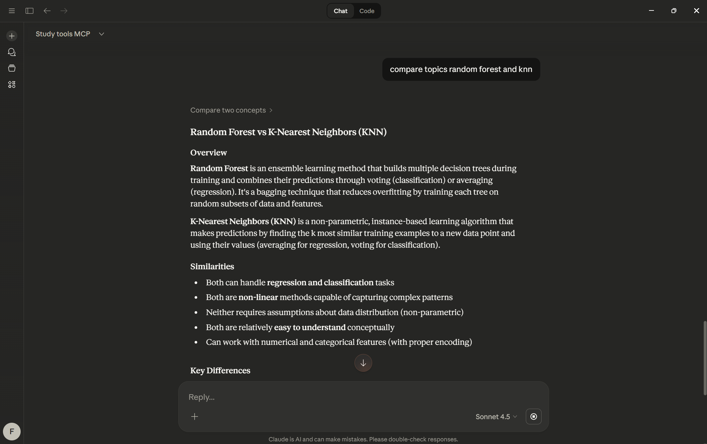

# Study Tools MCP 📚


An AI-powered study assistant built with Model Context Protocol (MCP) that generates quizzes, flashcards, summaries, and concept explanations from your study materials.

## 🎯 Features

- **Smart Summarization** - Generate concise summaries from study materials
- **Quiz Generation** - Create customizable quizzes with difficulty levels
- **Concept Explanation** - Get beginner/intermediate/advanced explanations
- **Flashcards** - Auto-generate flashcard decks from documents
- **Comparison Tool** - Compare and contrast multiple concepts
- **MCP Integration** - Works directly with Claude Desktop
- **Web UI** - Standalone chat interface with FastAPI backend

## 🛠️ Tech Stack

- **Backend**: FastAPI + Python 3.10
- **MCP**: Model Context Protocol server/client
- **AI**: OpenAI API
- **Document Parsing**: PyPDF2, pdfplumber, python-docx
- **Frontend**: Vanilla JavaScript, HTML, CSS

## 🚀 Quick Start

### Prerequisites

- Python 3.10+
- OpenAI API key

### Installation

1. Clone the repository:

```bash
git clone <your-repo-url>
cd 4.study-tools-mcp
```

2. Install dependencies:

```bash
pip install -e .
```

3. Create `.env` file:

```bash
cp .env.example .env
# Edit .env and add your OPENAI_API_KEY
```

4. Add your study materials:

Place PDF or Markdown files in `data/notes/`:
```
data/notes/
├── Machine Learning.pdf
└── Your Notes.md
```

5. Run the application:

```bash
python app.py
```

6. Open browser:

```
http://localhost:8080
```

## ☁️ AWS Deployment Architecture

**Live URL:** http://54.82.187.91:8080

### Architecture

```
GitHub Push
    ↓
GitHub Actions (CI/CD)
    ↓ SSH
EC2 (Ubuntu t2.micro)
    ↓ pulls PDFs at startup
S3 Bucket (study-tools-mcp-materials)
    ↓ fetches API key at runtime
AWS Secrets Manager (study-tools-mcp/openai-api-key)
```

### AWS Services Used

| Service | Purpose |
|---------|---------|
| **EC2** | Hosts the Docker container (Ubuntu t2.micro) |
| **S3** | Stores PDF study materials (persists independently of EC2) |
| **Secrets Manager** | Stores OpenAI API key securely (no .env files on server) |
| **IAM Role** | Grants EC2 permission to access S3 and Secrets Manager |
| **GitHub Actions** | Auto-deploys on every push to main branch |

### Deployment Steps

**1. Create S3 bucket and upload PDFs**
```bash
# AWS Console → S3 → Create bucket → study-tools-mcp-materials
aws s3 cp data/notes/ s3://study-tools-mcp-materials/ --recursive
```

**2. Store API key in Secrets Manager**
```bash
# AWS Console → Secrets Manager → Store secret
# Secret name: study-tools-mcp/openai-api-key
# Key: OPENAI_API_KEY, Value: your-api-key
```

**3. Create IAM Role for EC2**
```
IAM → Roles → Create role → EC2
Attach: AmazonS3ReadOnlyAccess + SecretsManagerReadWrite
Name: study-tools-mcp-ec2-role
```

**4. Launch EC2 instance**
```
Ubuntu t2.micro → Attach IAM role: study-tools-mcp-ec2-role
Security group: port 22 (SSH) + port 8080 (app) open to 0.0.0.0/0
```

**5. SSH into EC2 and run the app**
```bash
sudo apt update && sudo apt install -y docker.io git
sudo systemctl start docker
sudo usermod -aG docker ubuntu

git clone https://github.com/francis-rf/study-tools-mcp-server.git
cd study-tools-mcp-server

# Pull PDFs from S3
mkdir -p data/notes
aws s3 cp s3://study-tools-mcp-materials/ data/notes/ --recursive

# Get API key from Secrets Manager
export OPENAI_API_KEY=$(aws secretsmanager get-secret-value \
  --secret-id study-tools-mcp/openai-api-key \
  --region us-east-1 \
  --query SecretString \
  --output text | python3 -c "import sys,json; print(json.load(sys.stdin)['OPENAI_API_KEY'])")

# Build and run
docker build -t study-tools-mcp .
docker run -d \
  -p 8080:8080 \
  -e OPENAI_API_KEY=$OPENAI_API_KEY \
  -v $(pwd)/data/notes:/app/data/notes \
  --name study-tools-mcp \
  --restart unless-stopped \
  study-tools-mcp
```

**6. GitHub Actions CI/CD**

Add these secrets in GitHub → Settings → Secrets → Actions:
- `EC2_HOST` - EC2 public IP
- `EC2_USER` - ubuntu
- `EC2_SSH_KEY` - contents of .pem key file

Every push to `main` automatically SSHes into EC2 and redeploys the container.

### Pause / Cleanup

```
# Pause: EC2 Console → Instances → Stop instance
# Full cleanup: Terminate instance → Empty + Delete S3 bucket → Delete secret
```

## 🐳 Docker (Local)

### Build and Run

```bash
docker build -t study-tools-mcp .
docker run -p 8080:8080 --env-file .env -v ./data/notes:/app/data/notes study-tools-mcp
```

## 📁 Project Structure

```
study-tools-mcp/
├── app.py                      # FastAPI web application
├── src/study_tools_mcp/
│   ├── server.py               # MCP server entry point
│   ├── config.py               # Configuration
│   ├── tools/                  # Quiz, flashcards, summarizer, explainer
│   ├── parsers/                # PDF and Markdown parsers
│   └── utils/                  # Logger
├── static/                     # Frontend assets
├── templates/                  # HTML templates
├── data/notes/                 # Your study materials
├── logs/                       # Application logs
└── pyproject.toml              # Dependencies
```

## 💻 Usage

### Web UI

The web interface provides an interactive chat where you can ask the AI to:

| Tool | Example Prompt |
|------|---------------|
| Summarize | `Summarize the topic: neural networks` |
| Quiz | `Create a 5-question quiz on "decision trees" at intermediate level` |
| Explain | `Explain the concept "gradient descent" at beginner level` |
| Compare | `Compare these concepts: SVM KNN` |
| Flashcards | `Create 10 flashcards for: ensemble methods` |

### Claude Desktop Integration

Add to `%APPDATA%\Claude\claude_desktop_config.json`:

```json
{
  "mcpServers": {
    "study-tools-mcp": {
      "command": "uv",
      "args": ["--directory", "C:\\path\\to\\study-tools-mcp", "run", "study-tools-mcp"]
    }
  }
}
```

Restart Claude Desktop - the tools will be available automatically.

## 📡 API Endpoints

- `GET /` - Web UI
- `GET /health` - Health check
- `GET /api/files` - List available study materials
- `POST /api/chat` - Chat with streaming
- `POST /api/chat/clear` - Clear conversation history
## 📸 Screenshots


_Study Tool AI Interface with quiz generation_

_Study Tool AI Integration with Claude code desktop_

## 📄 License

MIT License
