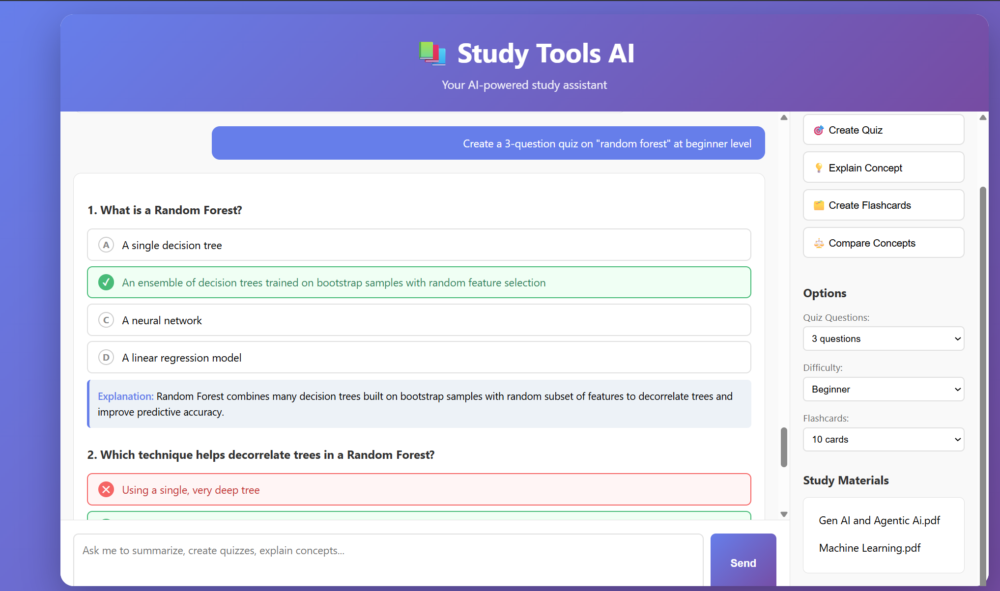
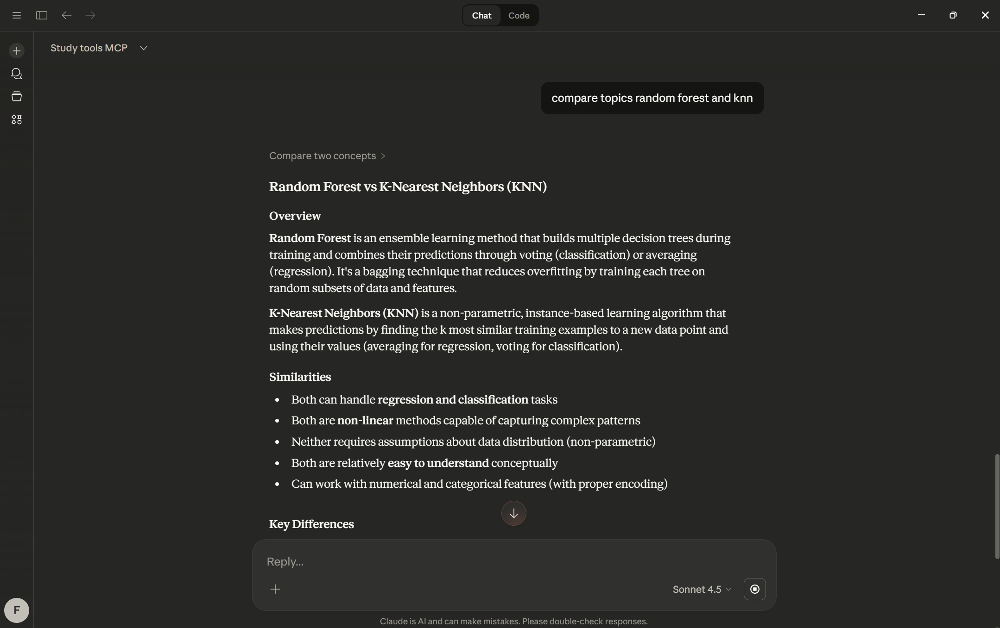

# Study Tools MCP 📚


[](https://github.com/francis-rf/study-Tools-mcp-server/actions/workflows/deploy.yml)
[](http://3.230.151.202:8080/)

An AI-powered study assistant built with Model Context Protocol (MCP) that generates quizzes, flashcards, summaries, and concept explanations from your study materials.

> **Live Demo:** [http://3.230.151.202:8080/](http://3.230.151.202:8080/)

## 🎯 Features

- **Smart Summarization** — Generate concise summaries from study materials
- **Quiz Generation** — Create customizable quizzes with difficulty levels
- **Concept Explanation** — Get beginner/intermediate/advanced explanations
- **Flashcards** — Auto-generate flashcard decks from documents
- **Comparison Tool** — Compare and contrast multiple concepts
- **MCP Integration** — Works directly with Claude Desktop
- **Web UI** — Standalone chat interface with FastAPI backend

## 🛠️ Tech Stack

- **Backend**: FastAPI + Python 3.10
- **AI Framework**: Model Context Protocol (MCP)
- **AI**: OpenAI API
- **Document Parsing**: PyPDF2, pdfplumber, python-docx
- **Frontend**: Vanilla JavaScript, HTML, CSS
- **Cloud**: AWS EC2 + S3 + Secrets Manager
- **CI/CD**: GitHub Actions

## 🚀 Quick Start

### Prerequisites

- Python 3.10+
- OpenAI API key

### Installation

1. Clone the repository:

```bash
git clone https://github.com/francis-rf/study-Tools-mcp-server.git
cd study-Tools-mcp-server
```

2. Install dependencies:

```bash
pip install -r requirements.txt
```

3. Create `.env` file:

```bash
cp .env.example .env
# Edit .env and add your OPENAI_API_KEY
```

4. Add study materials:

Place PDF or Markdown files in `data/notes/`:
```
data/notes/
├── Machine Learning.pdf
└── Your Notes.md
```

5. Run the application:

```bash
python app.py
```

6. Open browser:

`http://localhost:8080`

## 🐳 Docker Deployment

### Build and Run

```bash
docker build -t study-tools-mcp .
docker run -p 8080:8080 --env-file .env study-tools-mcp
```

## ☁️ AWS Deployment

### Services Used

| Service | Purpose |
|---------|---------|
| EC2 (t2.micro) | Hosts the Docker container |
| S3 (`study-tools-mcp-materials`) | Stores PDF study materials |
| Secrets Manager (`study-tools-mcp`) | Stores OpenAI API key |
| IAM Role | Grants EC2 access to S3 and Secrets Manager |

### Setup

1. Store OpenAI API key in **AWS Secrets Manager** under secret name `study-tools-mcp`
2. Upload PDFs to **S3** bucket `study-tools-mcp-materials`
3. Launch **EC2** instance with IAM role attached (`study-tools-mcp-ec2-role`)
4. SSH in, install Docker, clone repo and run container

### Live URL

The app is deployed and accessible at:

**[http://3.230.151.202:8080/](http://3.230.151.202:8080/)**

## ⚙️ GitHub Actions CI/CD

Automated deployment is configured via `.github/workflows/deploy.yml`.

### Workflow: Deploy to AWS EC2

On every push to `main`, the pipeline:

1. **Checks out** the code
2. **SSHs** into the EC2 instance
3. **Pulls** latest code from GitHub
4. **Rebuilds** the Docker image
5. **Restarts** the container with zero downtime

### Required GitHub Secrets

| Secret | Description |
|--------|-------------|
| `EC2_HOST` | EC2 instance public IP |
| `EC2_USER` | `ubuntu` |
| `EC2_SSH_KEY` | Contents of the `.pem` key file |

### Workflow Status

[](https://github.com/francis-rf/study-Tools-mcp-server/actions/workflows/deploy.yml)

## 📁 Project Structure

```
study-Tools-mcp-server/
├── app.py                          # FastAPI web application
├── src/study_tools_mcp/
│   ├── server.py                   # MCP server entry point
│   ├── config.py                   # Configuration (Secrets Manager + .env fallback)
│   ├── tools/                      # Quiz, flashcards, summarizer, explainer
│   ├── parsers/                    # PDF and Markdown parsers
│   └── utils/                      # Logger
├── static/                         # Frontend assets
├── templates/                      # HTML templates
├── data/notes/                     # Study materials (local only — S3 on AWS)
├── logs/                           # Application logs
├── .github/workflows/              # CI/CD
│   └── deploy.yml
├── Dockerfile
├── requirements.txt
└── pyproject.toml
```

## 📡 API Endpoints

| Method | Endpoint | Description |
|--------|----------|-------------|
| GET | `/` | Web UI |
| GET | `/health` | Health check |
| GET | `/api/files` | List available study materials |
| POST | `/api/chat` | Chat with streaming |
| POST | `/api/chat/clear` | Clear conversation history |

## 🔌 Claude Desktop Integration

Add to `%APPDATA%\Claude\claude_desktop_config.json`:

```json
{
  "mcpServers": {
    "study-tools-mcp": {
      "command": "uv",
      "args": ["--directory", "C:\\path\\to\\study-tools-mcp", "run", "study-tools-mcp"]
    }
  }
}
```

Restart Claude Desktop — the tools will be available automatically.

## 📸 Screenshots


_Study Tool AI Interface with quiz generation_


_Study Tool AI Integration with Claude Desktop_

## 📄 License

MIT License
